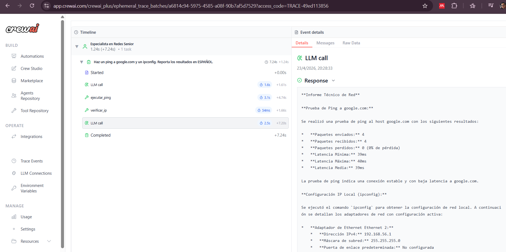

# 🛡️ Redes Automatizadas: Agentes IA con Gemini 2.5, Ollama & Vault

Este proyecto implementa una arquitectura avanzada de **agentes inteligentes** diseñados para realizar diagnósticos técnicos en infraestructuras Windows 11. El sistema utiliza **CrewAI** para la orquestación y permite tres modos de ejecución: Local (Ollama), Cloud (Gemini) y Secure Cloud (Gemini + HashiCorp Vault).

## 🚀 Versiones del Sistema

El proyecto cuenta con tres puntos de entrada dependiendo de la necesidad de infraestructura y seguridad:

1.  **`main-ollama.py`**: Ejecución 100% local. Ideal para entornos sin internet o pruebas de privacidad utilizando **Llama 3.1**.
2.  **`main-gemini.py`**: Ejecución en la nube. Utiliza el modelo **Gemini 2.5 Flash Lite** mediante llaves en archivos `.env`.
3.  **`main.py` (Versión Vault)**: Ejecución de nivel empresarial. Extrae las API Keys de forma segura desde **HashiCorp Vault**, eliminando secretos en texto plano.

## 📋 Pre-requisitos

-   **SO**: Windows 11 (PowerShell con permisos de ejecución).
-   **Lenguaje**: Python 3.10+
-   **IA Local**: Ollama instalado (solo para `main-ollama.py`).
-   **Seguridad**: HashiCorp Vault instalado y en modo servidor (solo para `main.py`).

## 🛠️ Instalación y Configuración

### 1. Limpieza e Instalación de Dependencias
Debido a conflictos históricos entre versiones de Pydantic y LiteLLM, se recomienda esta instalación limpia:

```powershell
# Purga de paquetes conflictivos
pip uninstall crewai litellm pydantic python-dotenv -y

# Instalación de stack estable
pip install crewai[google] langchain-google-genai python-dotenv hvac
```

## 🧾 Evidencia de funcionamiento


